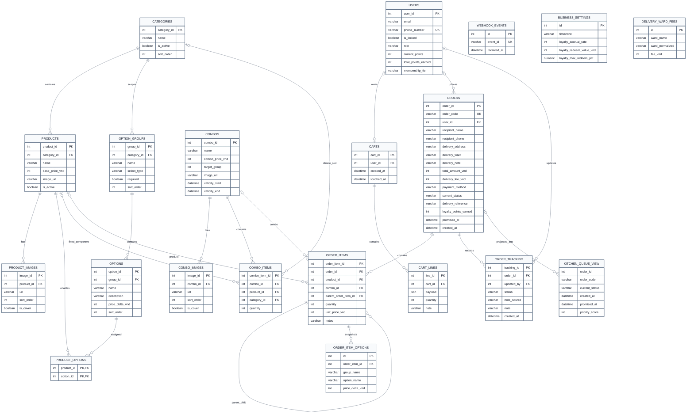
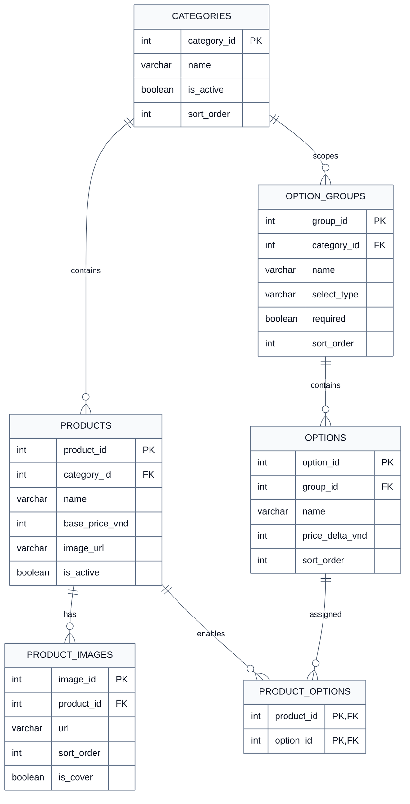
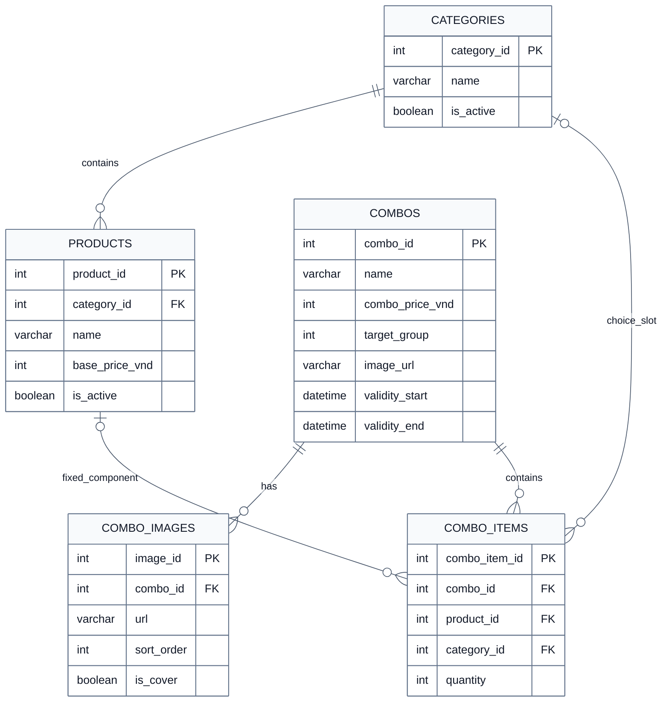
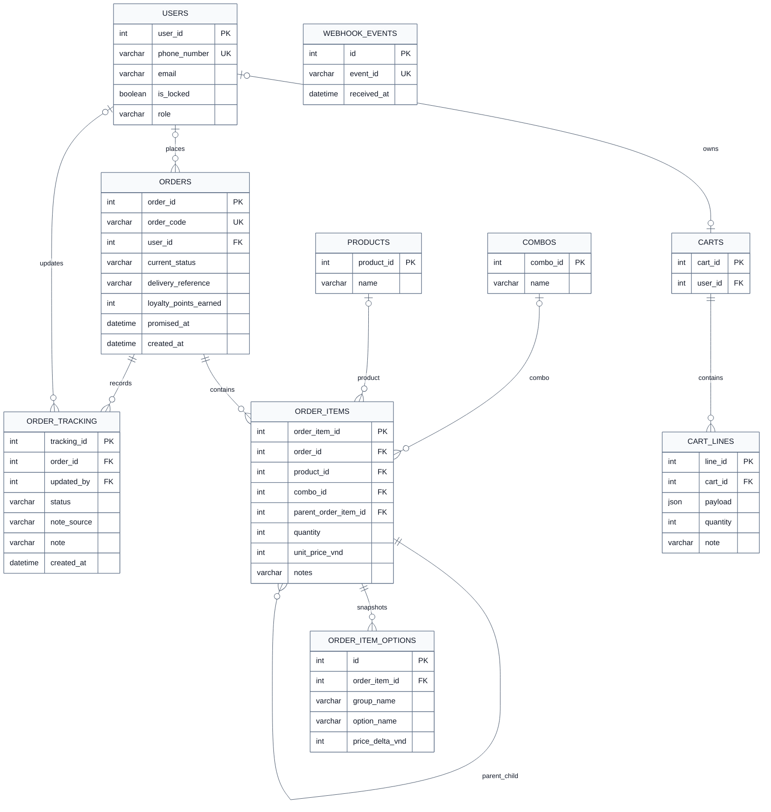
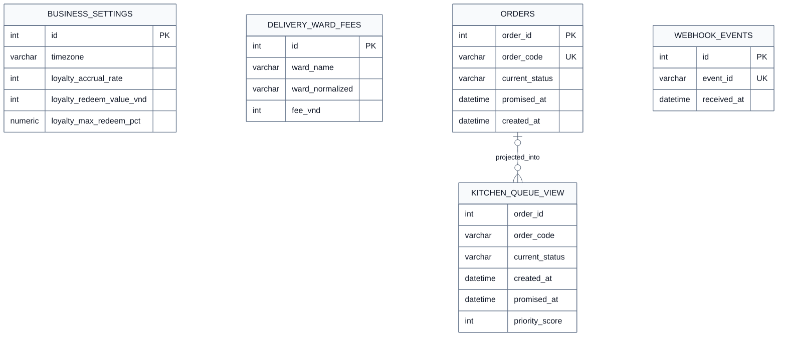

# Section 6 ERD Patch Plan

This file is a ready-to-follow plan for correcting Section 6 of the PizzaHUST final report.

Scope:
- review and correct the database-design section only
- prepare one full ERD for the whole current schema
- prepare several smaller logical ERDs for readability
- do not patch the report yet until the rendered ERD images are generated and reviewed

## Goal

Rework Section 6 so it clearly separates:

- current evolved schema truth
- conceptual and logical ERD presentation

And ensure the diagrams cover:

- one full ERD with all current tables and relations
- several smaller ERDs grouped by logical concern

After the ERD images are rendered, the report should be patched so that:

- captions match the actual schema
- surrounding prose matches the current codebase
- old DBML-era mismatches are removed

## Keep With Minimal Or No Change

These parts of Section 6 are already good enough:

- database design goals
- guest vs customer ordering explanation
- snapshot preservation explanation
- kitchen queue view explanation
- migration evolution framing

Target file:
- `Documents/Final Report/latex_report/sections/06_database_design.tex`

## Rewrite Required

### 1. Conceptual ERD and evolved implementation schema

Keep the distinction, but make it explicit that:

- old DBML is background and design history
- report diagrams should be regenerated from the current evolved schema
- conceptual simplification is acceptable, but not factual drift

### 2. Entity groups and relationships

Update the support/runtime group so it explicitly includes:

- `business_settings`
- `delivery_ward_fees`
- `webhook_events`

Also keep image-gallery tables explicit:

- `product_images`
- `combo_images`

### 3. Relationship overview

Replace weak framing like:

- "DBML-derived figures remain useful"

With stronger wording like:

- one full ERD gives complete current-schema coverage
- smaller ERDs are logical grouped views of the same current schema

### 4. High-level relationship bullets

Keep the existing correct ideas, but add current-schema details for:

- category-owned option groups
- combo choice slots through `combo_items.category_id`
- product and combo gallery images
- `webhook_events` for idempotency
- `business_settings` and `delivery_ward_fees` as operational support tables
- `order_tracking.note_source`
- `DispatchPending` as a real workflow state when discussing operational flow

## Current-Schema Mismatches To Fix

Source of truth:

- `Application/backend/app/infra/db/models.py`
- `Application/schema.dbml`

Important mismatches:

1. `schema.dbml` still has `products.is_pizza`, but current ORM does not.
2. `schema.dbml` still models `option_groups` as globally standalone; current ORM makes them category-owned through `category_id`.
3. `schema.dbml` still models `combo_items` as fixed-product only; current ORM supports XOR `product_id` vs `category_id`.
4. `schema.dbml` omits `DispatchPending`, but current ORM includes it.
5. `schema.dbml` omits:
   - `product_images`
   - `combo_images`
   - `webhook_events`
   - `business_settings`
   - `delivery_ward_fees`
6. `schema.dbml` omits:
   - `orders.loyalty_points_earned`
   - `order_tracking.note_source`

## Final ERD Set To Prepare

Recommended ERD set for Section 6:

1. `database_overview_full.mmd`
2. `database_catalog_options.mmd`
3. `database_combos.mmd`
4. `database_orders.mmd`
5. `database_support_runtime.mmd`

Recommended output PDFs:

1. `latex_report/figures/database_overview_full.pdf`
2. `latex_report/figures/database_catalog_options.pdf`
3. `latex_report/figures/database_combos.pdf`
4. `latex_report/figures/database_orders.pdf`
5. `latex_report/figures/database_support_runtime.pdf`

## General ERD

Purpose:
- one complete logical ERD containing all current schema tables and relationships

Recommended caption:
- `Complete current logical ERD of PizzaHUST`

Recommended Mermaid source:
- `latex_report/mermaid_sources/database_overview_full.mmd`

### Mermaid Code

## Smaller ERD 1: Catalog And Options

Recommended file:
- `latex_report/mermaid_sources/database_catalog_options.mmd`

Recommended caption:
- `Current catalog, image, and option-enablement relationships`

### Mermaid Code

## Smaller ERD 2: Combos

Recommended file:
- `latex_report/mermaid_sources/database_combos.mmd`

Recommended caption:
- `Current combo campaign, image, and choice-slot relationships`

### Mermaid Code

## Smaller ERD 3: Orders, Cart, Tracking

Recommended file:
- `latex_report/mermaid_sources/database_orders.mmd`

Recommended caption:
- `Current cart, order, tracking, and snapshot relationships`

### Mermaid Code

## Smaller ERD 4: Runtime Support

Recommended file:
- `latex_report/mermaid_sources/database_support_runtime.mmd`

Recommended caption:
- `Operational support and runtime-configuration relationships`

### Mermaid Code

## Caption Replacement Plan

Use these captions in Section 6:

- full ERD:
  - `Complete current logical ERD of PizzaHUST`
- catalog/options:
  - `Current catalog, image, and option-enablement relationships`
- combos:
  - `Current combo campaign, image, and choice-slot relationships`
- orders:
  - `Current cart, order, tracking, and snapshot relationships`
- support/runtime:
  - `Operational support and runtime-configuration relationships`

## Report Patch Steps After Images Are Ready

After the diagrams are rendered and reviewed:

1. replace or add Mermaid sources under:
   - `Documents/Final Report/latex_report/mermaid_sources`
2. replace or add generated figure PDFs under:
   - `Documents/Final Report/latex_report/figures`
3. patch:
   - `Documents/Final Report/latex_report/sections/06_database_design.tex`
4. update:
   - figure order
   - captions
   - relationship-overview wording
   - entity-group wording if needed
5. compile the report and check for layout issues

## Note For Section 7

For `User Interface Design`, keep it light and general for now:

- design goals
- information architecture
- visual direction
- responsive behavior
- accessibility intent

Then later add the screen images when you prepare those resources.
