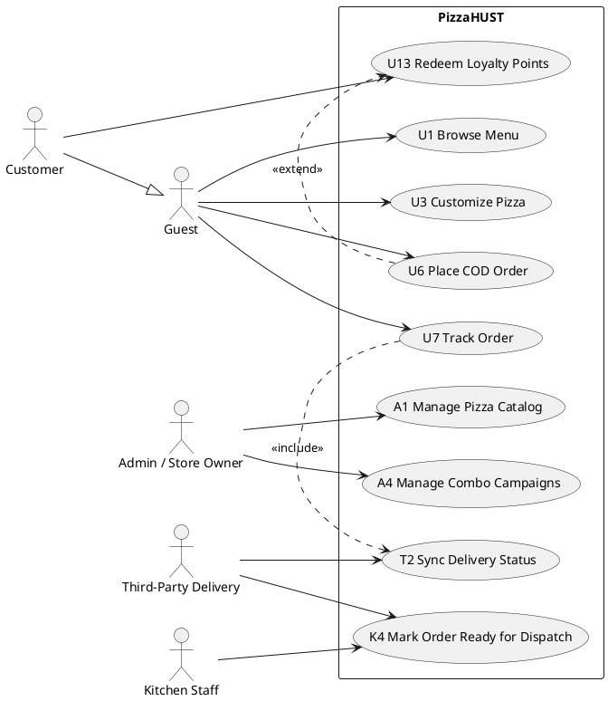

# 02 – Use-Case Analysis

## Khung lý thuyết

- Theo `9__Requirement_Modeling.pdf`: use case diagram thuộc nhóm
  "modeling interactions between users and systems" và là tâm điểm của
  **4+1 view** (Use-Case View — "end-user functionality", kết nối Logical
  / Process / Implementation / Deployment views).
- Theo `Requirement_Analysis_Session_Assignment`:
  - Dùng **use-case diagram** để mô tả interaction giữa actor và hệ
    thống.
  - **Lỗi thường gặp cần tránh**: coi front-end là actor; coi back-end
    là "system"; coi database là actor. "System" luôn là PizzaHUST
    (frontend + backend + DB) như một hộp đen — actor chỉ là con
    người/hệ thống ngoài đứng tương tác với hộp đen đó.
  - Báo cáo chọn 5 use case quan trọng nhất, đa dạng actor, viết detail
    đầy đủ theo template — **đã hoàn thành** (U6, A1, K4, A4, U7). Nếu
    báo cáo cuối kỳ (10 section) cần *toàn bộ* hệ thống, có thể cần thêm
    use case khác (xem `00_glossary_and_context.md` §3) — nhưng PHẢI hỏi
    người dùng trước khi viết detail cho use case mới, vì viết spec đầy
    đủ tốn effort và cần số liệu/luồng cụ thể từ nhóm.

## Use Case Diagram

- Actor: Guest, Customer (Customer thường vẽ là generalization của
  Guest — "Customer extends Guest" theo Actors Summary), Admin/Store
  Owner, Kitchen Staff, Third-Party Delivery (vẽ ngoài boundary, nét
  đứt vì là external system).
- Quan hệ cần thể hiện đúng (đã biết từ use case spec hiện có):
  - U6 `<<extend>>` ← U13 (Redeem Loyalty Points) — extension point ở
    bước 5.
  - U7 `<<include>>` → T2 (Sync Delivery Status) — bước 6.
  - K4 → (gọi) Third-Party Delivery (boundary actor) ở bước 5–6.
  - Customer "extends" Guest (generalization arrow, không phải
    include/extend của use case).
- Vẽ bằng **PlantUML** (gọn, version-control friendly). Khung mẫu:



> Chỉ thêm use case ngoài 5 use case đã viết detail nếu người dùng xác
> nhận muốn vẽ diagram đầy đủ hệ thống (không chỉ 5 cái nộp buổi
> presentation). Nếu chưa rõ, hỏi 1 câu trước khi vẽ diagram lớn.

Sau khi có `.puml`, dùng Visualizer để preview nhanh, hoặc render ra PNG/
SVG để `\includegraphics` (xem `latex_writing_guide.md`).

## Use Case Specification Template (giữ đúng format)

Cấu trúc bám sát `Use_Case_-_Detail_-_Template.docx` /
`UCDetailExample.pdf` — đã được encode thành LaTeX environment trong
`assets/latex/usecase_template.tex`:

```latex
\begin{usecase}{U6}{Place COD Order}
  \ucactors{Guest, Customer}
  \ucbrief{...}
  \ucpre{...itemize...}
  \ucpost{...itemize...}

  \ucbasicflow{
    1 & User & Proceeds to checkout from the cart page. \\
    2 & System & Displays recipient and delivery information form. \\
    ...
  }

  \ucaltflows{
    1 & Step 3 & Delivery address is outside inner Hanoi coverage area.
      & System displays an error message... & Resumes at Step 3. \\
    ...
  }

  \ucinputdata{
    1 & Recipient Name & Full name of the delivery recipient. & Yes
      & Non-empty; max 100 characters. & Nguyen Van An \\
    ...
  }

  \ucoutputdata{
    1 & Order Code & Unique alphanumeric code... & PIZZ-XXXXXX
      & PIZZ-AB1234 \\
    ...
  }
\end{usecase}
```

`assets/latex/sections/02_use_case_analysis.tex` đã chứa **5 use case
hiện có** (U6, A1, K4, A4, U7) được transcribe đầy đủ vào template này
— dùng làm ví dụ định dạng cho bất kỳ use case mới nào.

## Quy tắc viết use case mới (nếu được yêu cầu)

1. Lấy mã từ bảng "đề xuất các mã còn trống" trong
   `00_glossary_and_context.md` §3 (hoặc hỏi nếu người dùng có mã khác).
2. Brief description theo công thức: "This use case describes the
   interaction between <actor(s)> and the PizzaHUST system when
   <actor(s)> wish(es) to <goal>."
3. Basic flow: đánh số bước, cột "Performed By" chỉ là `User` / `System`
   / `Admin` / `Kitchen Staff` / actor cụ thể — KHÔNG bao giờ là "Frontend"
   hay "Backend"/"Database".
4. Alternative flows: luôn có "Resume location" hoặc "Use case ends".
   Tối thiểu nên có 1 alt flow cho input không hợp lệ và 1 cho lỗi
   nghiệp vụ (ví dụ item hết hàng, trùng tên...).
5. Input/Output data table: field name nên khớp tên cột sẽ dùng ở
   section 6 (database) và field JSON ở section 9 (API) — kiểm tra với
   `00_glossary_and_context.md` trước khi đặt tên field mới.
6. Postconditions: viết dưới dạng "trạng thái hệ thống sau khi use case
   kết thúc thành công" — phải là điều có thể kiểm chứng (liên kết với
   test case ở section 10).

## Checklist review – Section 2

- [ ] Use case diagram: actor không bao gồm "Frontend/Backend/Database";
      `Customer` là generalization của `Guest` (không phải include).
- [ ] Mỗi use case trong diagram có (hoặc sẽ có) spec tương ứng — không
      vẽ use case "mồ côi" không có spec, và không viết spec mà không có
      trong diagram.
- [ ] 5 use case bắt buộc (U6, A1, K4, A4, U7) — kiểm tra actor đa dạng
      (Guest/Customer, Admin, Kitchen+external) vẫn đúng như Actors
      Summary.
- [ ] Mỗi spec có đủ: code, name, actors, brief description,
      preconditions, basic flow, alternative flows (≥1, có resume
      location/ends), input data table, output data table,
      postconditions.
- [ ] Field name trong input/output data đã đối chiếu với
      `00_glossary_and_context.md` §5/§6 (DB/API) — không có 2 tên khác
      nhau cho cùng 1 field qua các section.
- [ ] Mọi use case mới (nếu có) đã được thêm vào
      `00_glossary_and_context.md` §3 và use case diagram.
- [ ] LaTeX: dùng `usecase_template.tex`, mỗi use case có label
      `\label{uc:U6}` v.v. để section khác (user stories, test cases)
      `\ref{}` được.
