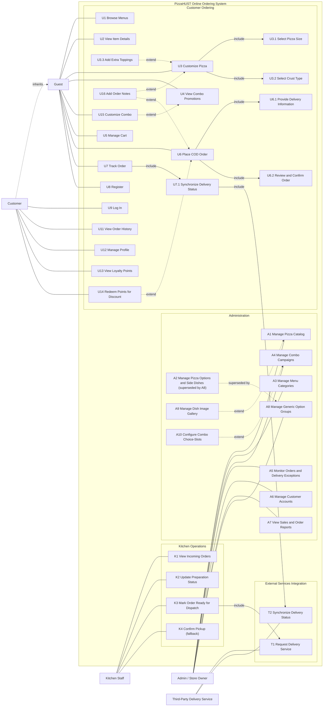

# PizzaHUST — Use-Case Specifications (v2)

Use-case specifications for the PizzaHUST online ordering and store management system.
Every use case is specified with its **main (basic) flow** and **alternative flows**,
following the class template (use-case code, actors, brief description, preconditions,
basic flow, alternative flows, postconditions); transactional use cases additionally
include input/output data tables.

Source of truth: `Application/PRODUCT.md`, `Application/ARCHITECTURE.md`,
`Application/CONTRACTS.md` at the v2 scope (2026-06-10 design decision, commit `e91f35f`).
The v1 diagram in `Documents/Mermaid.md` is superseded by the diagram below.

## Documents

| File | Actor group | Use cases |
|---|---|---|
| [01-customer.md](01-customer.md) | Guest / Customer | U1–U9, U11–U16 |
| [02-admin.md](02-admin.md) | Admin / Store Owner | A1–A10 |
| [03-kitchen.md](03-kitchen.md) | Kitchen Staff | K1–K4 |
| [04-delivery.md](04-delivery.md) | Third-Party Delivery | T1, T2 |

`U10` is intentionally reserved for the deferred AI recommendation flow and is not specified.

## Actors

| Actor | Type | Authentication | Role description |
|---|---|---|---|
| Guest | Primary (external) | None (session cart only) | Browses the menu, customizes pizzas and combos, places COD orders, tracks orders by order code. |
| Customer | Primary (registered) | Cookie session, role=`customer` | Inherits all Guest capabilities; adds login, profile, order history, loyalty points, point redemption. |
| Admin / Store Owner | Primary (internal) | Cookie session, role=`admin` | Manages dishes, options, categories, combos, customers; monitors orders and delivery exceptions; views reports. |
| Kitchen Staff | Primary (internal) | Cookie session, role=`kitchen` | Processes the prioritized kitchen queue, updates preparation status, dispatches orders, confirms pickup fallback. |
| Third-Party Delivery | External (supporting) | Outbound API key; inbound HMAC-signed webhook | Receives delivery booking requests (T1) and pushes delivery status updates back (T2). |

Roles `customer` / `admin` / `kitchen` are mutually exclusive.

## Use-case diagram (v2)



## Use-case index

Status reflects `Application/feature_list.json` on 2026-06-11:
**Implemented** = verified done; **Planned** = specified (v2 design), not yet built.

### Customer-facing (U)

| ID | Name | Actors | Status |
|---|---|---|---|
| U1 | Browse Menus | Guest, Customer | Implemented |
| U2 | View Item Details | Guest, Customer | Implemented |
| U3 | Customize Pizza | Guest, Customer | Implemented |
| U4 | View Combo Promotions | Guest, Customer | Implemented |
| U5 | Manage Cart | Guest, Customer | Planned |
| U6 | Place COD Order | Guest, Customer | Planned |
| U7 | Track Order | Guest, Customer | Planned |
| U8 | Register | Guest | Planned |
| U9 | Log In | Customer | Planned |
| U11 | View Order History | Customer | Planned |
| U12 | Manage Profile | Customer | Planned |
| U13 | View Loyalty Points | Customer | Planned |
| U14 | Redeem Points for Discount | Customer | Planned |
| U15 | Customize Combo (v2) | Guest, Customer | Planned |
| U16 | Add Order Notes (v2) | Guest, Customer | Planned |

### Admin (A)

| ID | Name | Actors | Status |
|---|---|---|---|
| A1 | Manage Pizza Catalog | Admin | Implemented |
| A2 | Manage Pizza Options and Side Dishes | Admin | Implemented (superseded by A8) |
| A3 | Manage Menu Categories | Admin | Implemented |
| A4 | Manage Combo Campaigns | Admin | Implemented |
| A5 | Monitor Orders and Delivery Exceptions | Admin | Planned |
| A6 | Manage Customer Accounts | Admin | Planned |
| A7 | View Sales and Order Reports | Admin | Planned |
| A8 | Manage Generic Option Groups (v2) | Admin | Implemented |
| A9 | Manage Dish Image Gallery (v2) | Admin | Planned |
| A10 | Configure Combo Choice-Slots (v2) | Admin | Implemented |

### Kitchen (K)

| ID | Name | Actors | Status |
|---|---|---|---|
| K1 | View Incoming Orders | Kitchen | Planned |
| K2 | Update Preparation Status | Kitchen | Planned |
| K3 | Mark Order Ready for Dispatch | Kitchen | Planned |
| K4 | Confirm Pickup (fallback) (v2) | Kitchen | Planned |

### Third-Party Delivery (T)

| ID | Name | Actors | Status |
|---|---|---|---|
| T1 | Request Delivery Service | Delivery (via Kitchen K3 / Admin A5) | Planned |
| T2 | Synchronize Delivery Status | Delivery | Planned |

## Shared business rules

Referenced throughout the specifications; single source `Application/PRODUCT.md`.

| Rule | Value |
|---|---|
| Delivery fee | 22,000 VND flat (inner Hanoi) |
| Service area | 51 post-2025-reorganization inner-Hanoi wards (whitelist); addresses outside are rejected at checkout |
| Loyalty accrual | 1 point per 10,000 VND of subtotal after discounts, credited only when the order reaches `Delivered` |
| Loyalty redemption | 1 point = 1,000 VND discount, capped at 50% of the subtotal after combo discounts |
| Order code | `PIZZ-` + 6 Crockford base32 characters (no I/L/O/U) |
| Tracking rate limit | 5 requests / minute / IP on order-code lookup |
| Auth rate limit | 5 requests / minute / IP on login and register |
| Promised delivery time | 45 minutes from order creation (default) |
| Payment | Cash on delivery (COD) only |
| Pricing authority | `POST /api/cart/quote` — the frontend never computes prices |

### Order state machine

```
Received → Preparing → ReadyForDispatch → Delivering → Delivered
   ↘ Cancelled  ↘ DispatchPending → Delivering   ↘ DeliveryFailed
```

| From | To | Triggered by |
|---|---|---|
| Received | Preparing | K2 (kitchen accept) |
| Received | Cancelled | A5 (admin cancel) |
| Preparing | ReadyForDispatch | K3 + T1 success |
| Preparing | DispatchPending | K3 + T1 timeout/failure |
| Preparing | Cancelled | A5 |
| DispatchPending | Delivering | A5 retry dispatch (T1 success) |
| DispatchPending | Cancelled | A5 |
| ReadyForDispatch | Delivering | T2 webhook (`Accepted`/`PickedUp`) **or** K4 manual confirm pickup |
| Delivering | Delivered | T2 webhook (`Delivered`) |
| Delivering | DeliveryFailed | T2 webhook (`Failed`) |

`Delivered`, `DeliveryFailed`, `Cancelled` are terminal.
