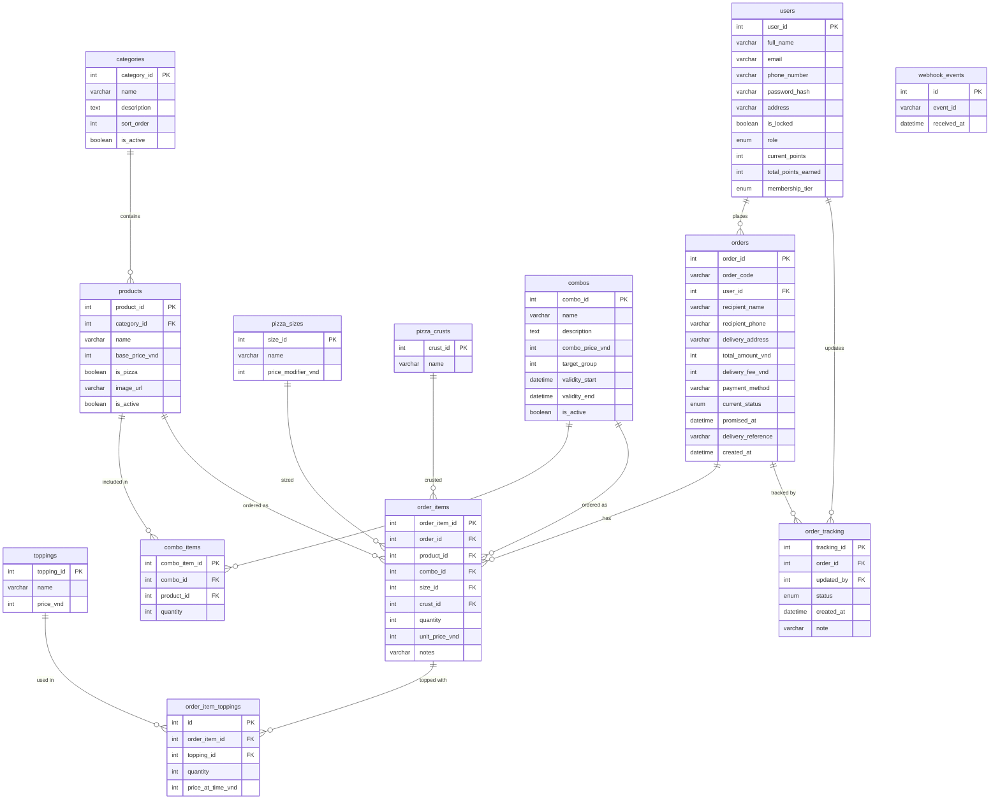

# PizzaHUST – ER Diagram (Week 3 Final)

## Ghi chú thiết kế

| Quyết định | Lý do |
|---|---|
| `order_items.product_id XOR combo_id` | CHECK constraint – một item chỉ là pizza đơn hoặc combo, không bao giờ cả hai |
| `combos.is_active` | APScheduler chạy mỗi 60s, tự flip `False` khi `validity_end < now()` |
| `products.is_active` | Admin deactivate thay vì xóa – giữ lịch sử order |
| `categories.sort_order` | UI kéo thả, persist qua `PUT /api/admin/categories/reorder` |
| `webhook_events.event_id` UNIQUE | Idempotency – delivery webhook trùng lặp không gây trạng thái lỗi |
| `users.total_points_earned` | Dùng tính tier upgrade (STANDARD→SILVER→GOLD) độc lập với điểm hiện tại |
